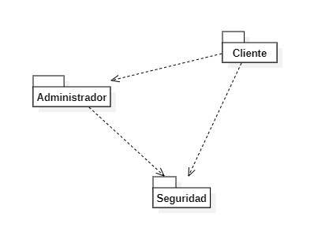
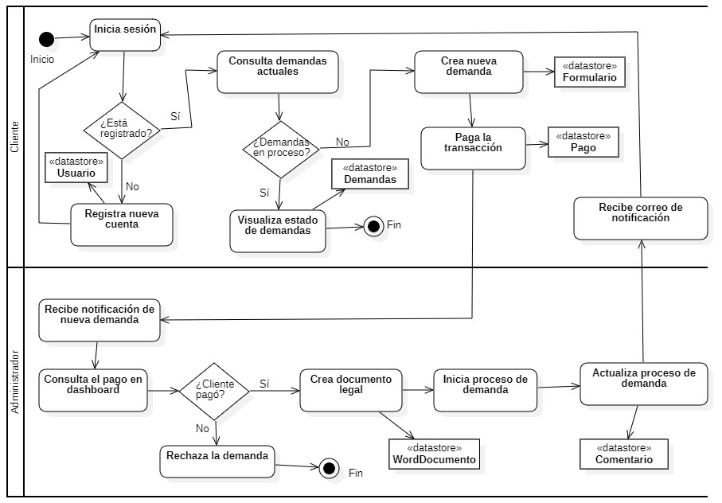

# Práctica Abogabot

## Requerimientos

Se encuentran enlistados los requerimientos funcionales y no funcionales, así como los requisitos técnicos ---> [Requerimientos](./Requerimientos-Abogabot.xlsx "Requerimientos")

## Diseño de arquitectura
Para desarrollar los siguientes diagramas se utilizó la herramienta [StarUML](https://staruml.io/)

### Vista de implementación (Diagrama de paquetes)

### Vista de proceso (Diagrama de actividades o flujograma)

## Buyer persona

---> [Buyer Persona](./BuyerPersona_Francisco.pdf "BuyerPersona")

## Público objetivo

Aún en proceso

## Wireframe UX
Aún en proceso

## UI
Aún en proceso
