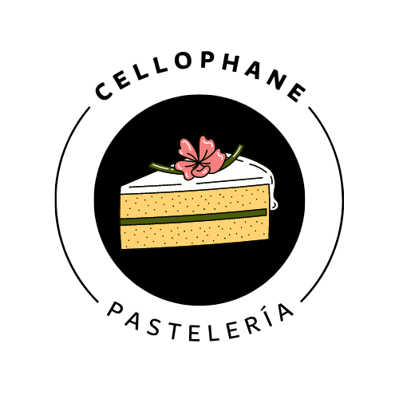
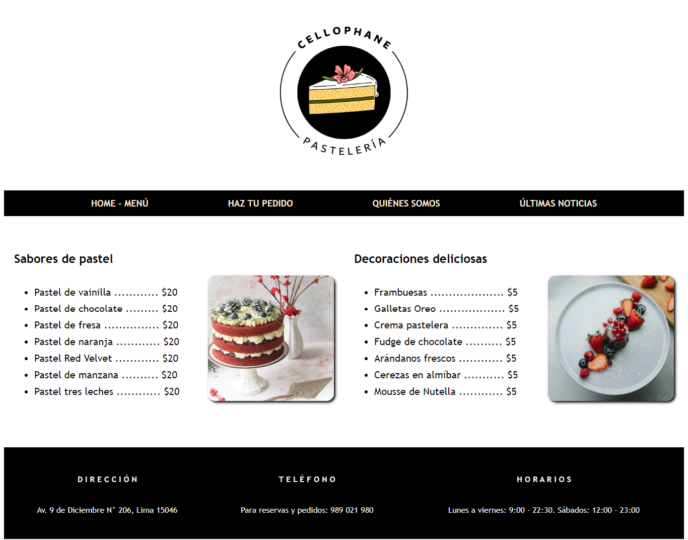
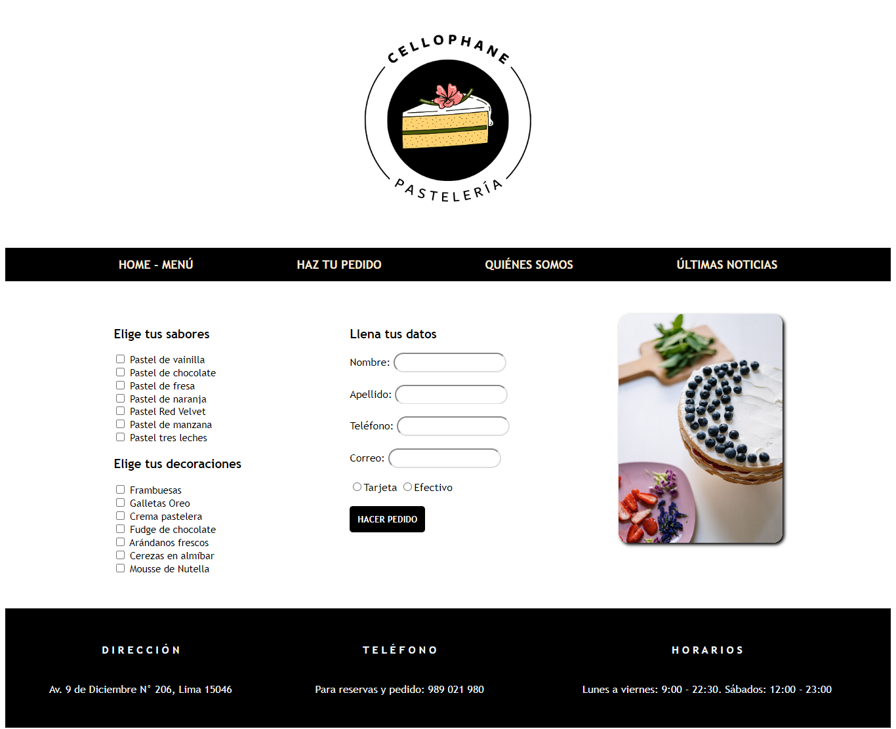

# Práctica Pastelería
Para esta práctica enfocada en el desarrollo de los conceptos de HTML se tuvo como caso la página web de una pastelería, orientada al cliente y con los formularios necesarios para la realización de un pedido.

## Logo de la pastelería

## Resultado
Usando lo aprendido en HTML y conceptos básicos de CSS, se logró maquetar el siguiente diseño de página web. He aquí las capturas.

